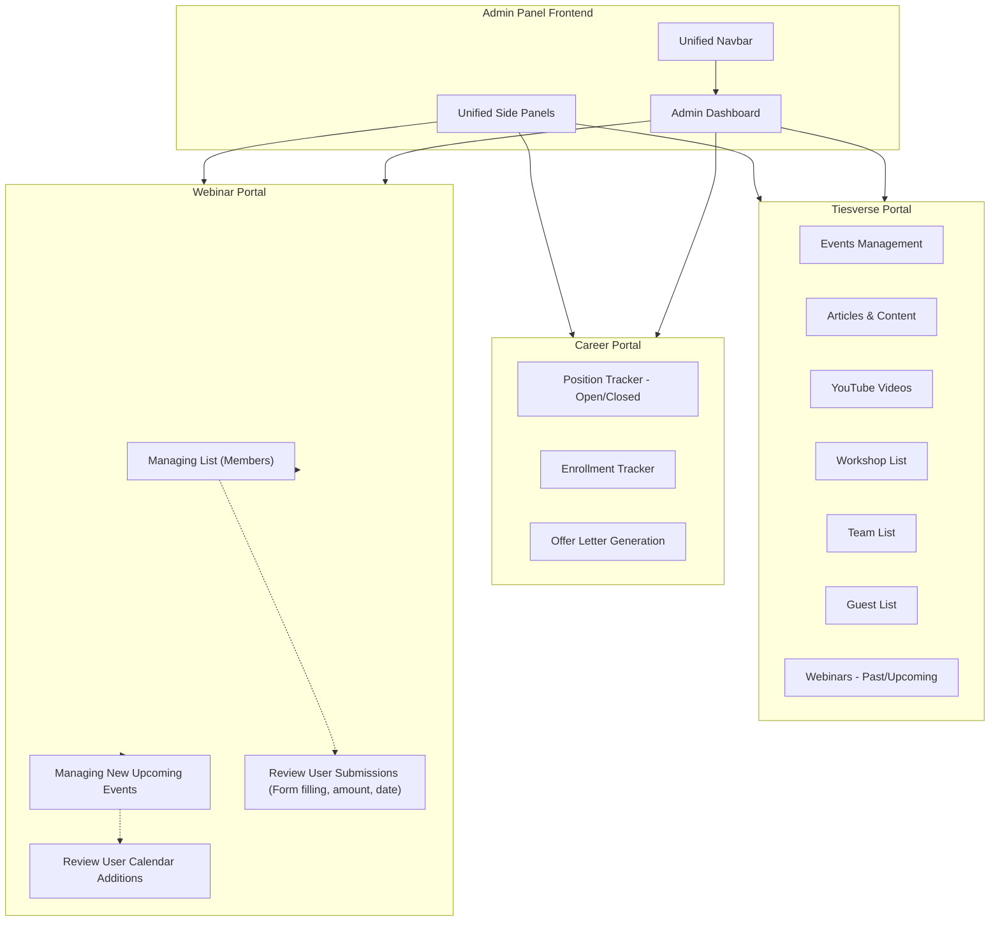

# Admin Control Center Implementation Plan

This plan outlines the architecture, directory structure, and file responsibilities for a centralized **Admin Control Center**. This application is **exclusively for admins** to manage data and monitor user actions from separate, public-facing websites (`tiesverse.com`, `career.tiesverse.com`, and `webinar.tiesverse.com`), which all share the same database.

## User Review Required

- Please review the proposed directory structure for the Django backend and React admin frontend below.
- Note: This plan strictly focuses on admin capabilities (viewing user submissions, accepting/notifying users, managing events) and assumes the user-facing websites are built separately.

## Proposed Architecture Diagram

## Proposed Changes

We will break this down into Backend (Django) and Frontend (React) file creation.

### Backend (Django REST API)

We will create separate Django apps for each domain to keep the business logic modular.

#### [NEW] `tiesverse_app/`
Manages the content for the main landing page.
- `models.py`: Models for Event, Article, YouTubeVideo, Workshop, TeamMember, Guest, Webinar.
- `views.py` & `urls.py`: API endpoints for CRUD operations on these models.
- `serializers.py`: DRF serializers for the models.

#### [NEW] `career_app/`
Manages the career portal functionality.
- `models.py`: Models for Position (with `is_open` boolean field), Enrollment, OfferLetter.
- `views.py` & `urls.py`: API endpoints for tracking positions, enrollments, and generating offer letters.
- `serializers.py`: DRF serializers.

#### [NEW] `webinar_app/`
Manages the webinar portal's admin controls.
- `models.py`: Models shared with the public site for WebinarEvent, RegistrationForm (includes date of filling, amount paid, etc.), CalendarEvent.
- `views.py` & `urls.py`: API endpoints for admins to create events, and to review/accept/notify user registrations.

### Frontend (React/Vite)

The frontend will have a unified layout with a persistent Navbar and Sidebar.

#### Layout Components
- #### [NEW] `frontend/src/components/layout/Navbar.jsx`
  Contains the top navigation bar to switch between Tiesverse, Career, and Webinar administrative sections.
- #### [NEW] `frontend/src/components/layout/Sidebar.jsx`
  Contains the side panels showing all functionalities for the currently selected portal.
- #### [NEW] `frontend/src/components/layout/AdminLayout.jsx`
  The wrapper component that includes the Navbar, Sidebar, and the main content area for routing.

#### Tiesverse Pages (`frontend/src/pages/Tiesverse/`)
- #### [NEW] `EventsManagement.jsx`: UI to create/edit/delete events.
- #### [NEW] `ArticlesManagement.jsx`: UI to manage articles and content.
- #### [NEW] `YoutubeVideos.jsx`: UI to manage YouTube video links.
- #### [NEW] `WorkshopList.jsx`: UI to manage workshops.
- #### [NEW] `TeamList.jsx`: UI to manage team members.
- #### [NEW] `GuestList.jsx`: UI to manage past and upcoming guests.
- #### [NEW] `Webinars.jsx`: UI to manage past and upcoming webinars.

#### Career Pages (`frontend/src/pages/Career/`)
- #### [NEW] `PositionTracker.jsx`: UI to toggle `position_var` (Open/Closed) and manage job listings.
- #### [NEW] `EnrollmentTracker.jsx`: UI to view and manage applicant enrollments.
- #### [NEW] `OfferLetter.jsx`: UI to generate and send offer letters.

#### Webinar Pages (`frontend/src/pages/Webinar/`)
- #### [NEW] `ManagingList.jsx`: UI to view the list of members/registrants and accept/notify them.
- #### [NEW] `ManageEvents.jsx`: UI to manage new upcoming events, dates, and times.
- #### [NEW] `UserSubmissionsReview.jsx`: UI to review user actions from the public site (e.g., date of form filling, transaction amounts, accepting notifications).

## Low-Level Design (LLD)

### Database Schema (Django Models)

**App: `tiesverse_app`**
- `Event`: `title` (Char), `description` (Text), `date` (DateTime), `location` (Char), `is_active` (Boolean).
- `Article`: `title` (Char), `content` (Text), `author` (Char), `published_date` (Date).
- `YouTubeVideo`: `title` (Char), `url` (URL), `thumbnail_url` (URL).
- `Workshop`: `title` (Char), `instructor` (Char), `schedule` (DateTime).
- `TeamMember`: `name` (Char), `role` (Char), `linkedin_url` (URL), `image` (Image).
- `Guest`: `name` (Char), `affiliation` (Char), `is_upcoming` (Boolean).

**App: `career_app`**
- `Position`: `title` (Char), `department` (Char), `description` (Text), `is_open` (Boolean).
- `Enrollment` (Applicant): `position` (FK to Position), `applicant_name` (Char), `email` (Email), `resume` (File), `status` (Choices: Pending, Reviewed, Accepted, Rejected).
- `OfferLetter`: `applicant` (FK to Enrollment), `salary` (Decimal), `joining_date` (Date), `generated_pdf` (File).

**App: `webinar_app`**
- `WebinarEvent`: `title` (Char), `speaker` (Char), `scheduled_time` (DateTime), `meeting_link` (URL).
- `RegistrationForm`: `webinar` (FK to WebinarEvent), `user_name` (Char), `user_email` (Email), `date_of_filling` (DateTime - auto_now_add), `amount_paid` (Decimal), `payment_status` (Choices: Pending, Success, Failed), `is_accepted` (Boolean), `notification_sent` (Boolean).
- `CalendarEvent`: `webinar` (FK to WebinarEvent), `calendar_id` (Char), `sync_status` (Boolean).

### API Endpoints (Django REST Framework)

**`tiesverse_app`**
- `GET/POST /api/tiesverse/events/`
- `GET/POST /api/tiesverse/articles/`
- `GET/POST /api/tiesverse/youtube-videos/`
- `GET/POST /api/tiesverse/workshops/`
- `GET/POST /api/tiesverse/team/`
- `GET/POST /api/tiesverse/guests/`

**`career_app`**
- `GET/POST /api/career/positions/` (Toggle `is_open` here)
- `GET /api/career/enrollments/` (List all applicants)
- `PATCH /api/career/enrollments/<id>/` (Update applicant status)
- `POST /api/career/offer-letters/generate/` (Generate offer for an applicant)

**`webinar_app`**
- `GET/POST /api/webinar/events/` (Manage upcoming webinars)
- `GET /api/webinar/registrations/` (View members/submissions, form filling dates, amounts)
- `POST /api/webinar/registrations/<id>/accept/` (Admin accepts user and triggers notification)
- `POST /api/webinar/events/<id>/calendar-sync/` (Sync dates to calendar)

### Frontend Components (React/Vite)

- **State Management**: Use React Context or Redux Toolkit for managing the global state (e.g., currently selected portal, authentication state).
- **API Client**: Axios or Fetch API for making requests to the Django backend.
- **Routing**: React Router DOM (`/tiesverse/*`, `/career/*`, `/webinar/*`).
- **UI Library**: Use Material-UI (MUI), TailwindCSS, or a similar component library for tables, forms, sidebars, and modals to ensure a premium look.

**Core Data Flows**:
1. *Webinar Review Flow*: Admin navigates to `/webinar/submissions` -> Component fetches `GET /api/webinar/registrations/` -> Renders data table with 'Date of Filling', 'Amount Paid' -> Admin clicks "Accept" -> Component calls `POST /api/webinar/registrations/<id>/accept/` -> Success toast shown.
2. *Career Position Toggle Flow*: Admin navigates to `/career/positions` -> Fetches positions -> Admin toggles `position_var` switch -> Component calls `PATCH /api/career/positions/<id>/` with `{"is_open": false}` -> Updates local state.

## Verification Plan

- Check if the Django apps are created properly and models are migrated according to LLD.
- Verify if the React components render the unified layout (Navbar, Sidebar).
- Verify the routing between different sections (Tiesverse, Career, Webinar).
